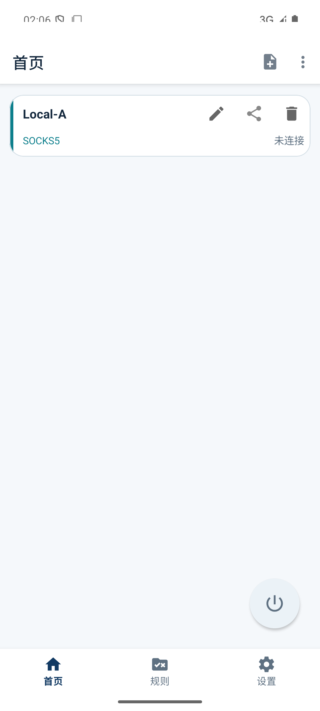
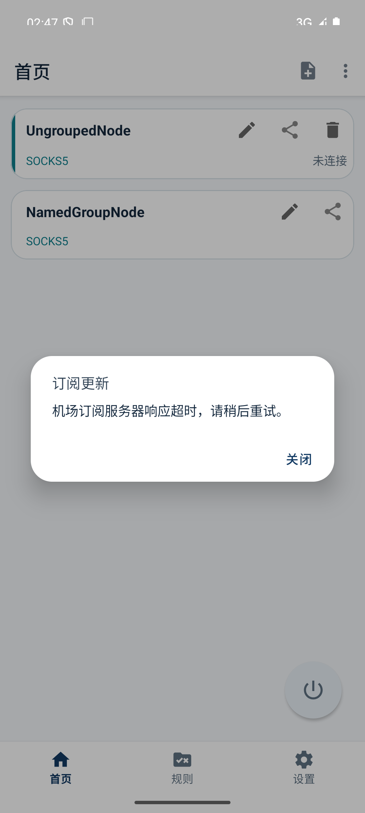
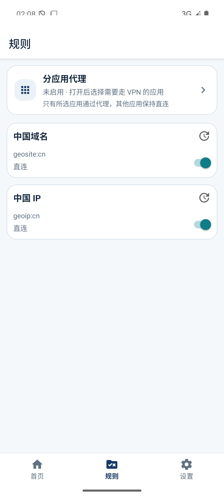
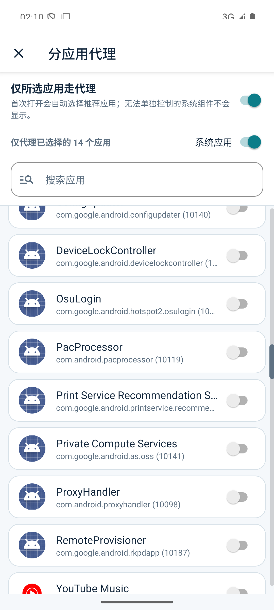
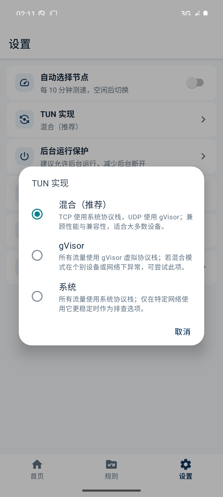
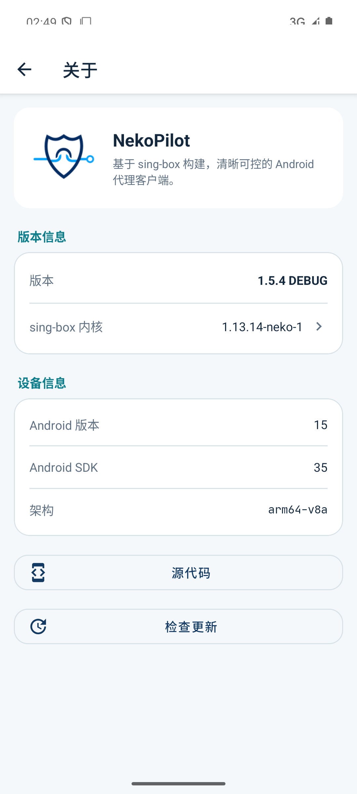

# NekoPilot Android 全面体验与稳定性复核

日期：2026-07-20  
环境：Android 15 ARM64 模拟器，NekoPilot 1.5.4 Debug / Release  
范围：首页节点与连接、订阅、规则资产、分应用代理、设置、后台服务、配置生成、Go/Rust 数据层、构建与签名。

## 结论

本轮确认并修复了首页空态导入后未默认选中、节点删除/编辑后的活动状态不一致、订阅并发和部分解析导致的数据丢失、订阅定时任务空指针、后台服务与默认网络监听竞争、自动选择大列表遗漏候选、列表测速刷新抖动、分应用代理隐藏项丢失、Android 15 顶部内容重叠、重复/不明确的无障碍文案等问题。

代码级回归、Debug/Release 构建、签名检查和模拟器主流程均通过。当前唯一未完成的运行时结论是真实代理出口：本次只有模拟器，且提供的外部订阅源在测试时响应超时；应用已正确显示可理解的错误并保持稳定。

## 关键流程

1. **首页空态 → 导入 → 默认选中 → 连接：健康**
   - 首次导入的可用节点会自动成为当前节点。
   - 连接按钮只表达未连接、连接中、已连接和失败状态。
   - 模拟器中 Android VPN 生命周期已进入系统已连接状态；未将测试代理端点当作真实外网成功。

   

2. **节点测速 → 动态按延迟排序 → 编辑/删除：健康**
   - 单节点延迟变化使用二分移动；批量结果合并后一次刷新，降低列表抖动和重复排序。
   - 活动节点连接期间禁止破坏性编辑/删除；删除当前节点后会安全选择下一可用节点。
   - 节点操作的读屏说明包含节点名称，避免列表内重复按钮无法区分。

3. **机场订阅导入与更新：部分通过**
   - 更新过程展示当前机场、进度和“最小化”；结束后展示明确结果。
   - 订阅下载限制为 32 MiB，Go 文档解析限制为 1 MiB，避免异常响应造成内存放大。
   - 部分可解析的订阅会保留既有节点，不会因一个临时坏节点删除整组数据；更新过程串行化并具备跨进程锁。
   - 外部测试源本次响应超时，因此成功下载链路未在当前环境完成；失败链路已通过。

   

4. **规则资产 → 中国域名 / 中国 IP 更新：健康**
   - 默认规则受保护，恢复和删除逻辑具备回归测试。
   - 资产写入采用临时文件、校验和与原子替换；主源失败可回退备用源。
   - 更新弹窗展示检查、下载、完成或无更新结果。

   

5. **分应用代理：健康**
   - 首次进入按产品策略执行一次推荐选择，后续保留用户选择。
   - 系统应用筛选不会误删当前已选但暂时隐藏的包名。
   - 应用行支持整行点击、键盘焦点和已选/未选状态描述；滚动后顶部区域不遮挡内容。

   

6. **设置 → TUN → 关于：健康**
   - 使用现有视觉系统统一卡片、间距、圆角、分隔线和入口箭头。
   - TUN 选项改为本地化名称和简短说明；关于页版本信息和内核入口层级清晰。

   
   
   

7. **后台连接与默认网络切换：健康**
   - 连接回调和默认网络监听引入代次校验，旧回调不能覆盖新状态。
   - 网络事件由单一 actor 顺序处理，停止时等待清理完成。
   - Go 内核初始化失败不会被错误标记为成功；仅在真正连接时加载后台原生核心。

8. **性能与自动化：健康，存在环境限制**
   - 最终 Debug 冷启动三次：5849 / 2477 / 3918 ms，中位数 3918 ms（模拟器数据，仅作趋势基线）。
   - 稳定首页进程：TOTAL PSS 约 86 MiB、TOTAL RSS 约 187 MiB（Debug 模拟器，不能等同正式真机）。
   - Android instrumentation：15 项中 14 项通过，1 项因未注入运行时订阅地址按设计跳过。
   - Maestro MCP 在本机持续返回 `UNAVAILABLE`，因此使用 ADB、UIAutomator 和 instrumentation 完成等价检查；这是测试工具可用性限制，不是 App 缺陷。

## 验证记录

- `go test -count=1 ./...`：通过。
- Rust：`cargo test --locked`，11/11 通过；格式检查通过。
- Gradle：Debug 单元测试、Lint、Debug APK、AndroidTest APK、Release APK 全部通过。
- Android instrumentation：`OK (15 tests)`，14 通过、1 条件跳过。
- Release APK：`NekoPilot-1.5.4-arm64-v8a.apk`，约 14 MiB，versionCode 255，v1/v2 签名验证通过。
- APK 内含 `libgojni.so` 与 `libnekodata_core.so` ARM64 原生库。
- 最终 Logcat 未发现新的 `FATAL EXCEPTION`；订阅超时不崩溃。

## 仍需真机补充验证

- 使用可用的机场订阅完成一次成功更新，并连接真实节点验证 HTTPS 出口。
- 在小米真机上观察后台保活、系统 VPN 状态、锁屏/切网恢复和桌面启动图标。
- 以正式 APK 测量冷启动、功耗、内存和长时间连接稳定性；模拟器数据不作为真机性能结论。
