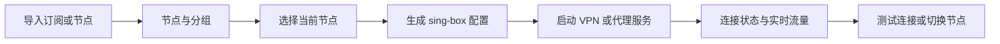
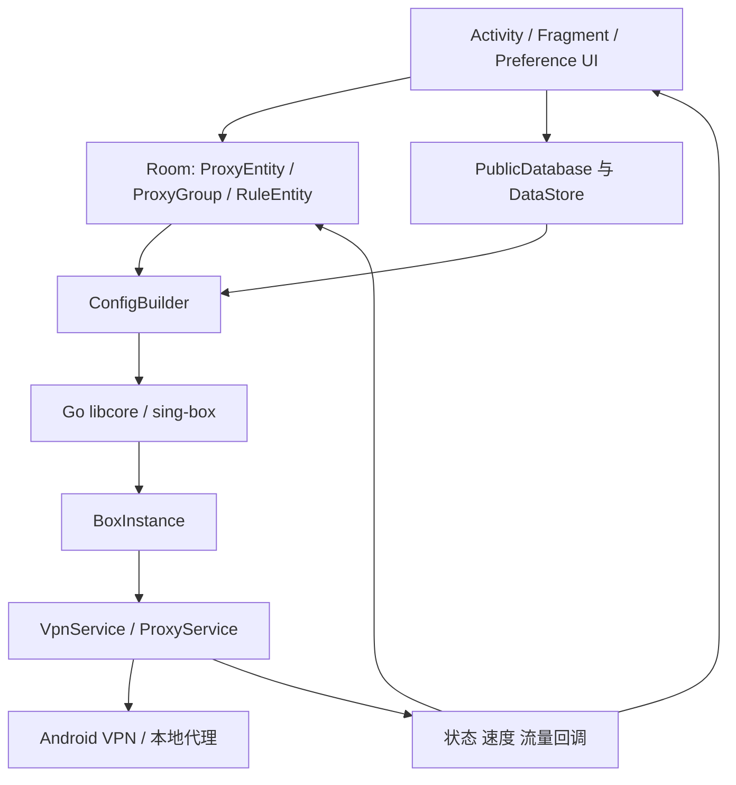

# NekoPilot 功能与界面结构

## 产品主路径

NekoPilot 的首要任务是：导入节点，选择节点，确认当前状态，一键连接。

## 新的信息架构

底部只保留四个高频入口；低频和专业功能继续保留在各页左上角的高级菜单中。

| 一级入口 | 用户目标 | 主要能力 |
| --- | --- | --- |
| 连接 | 看状态并一键启停 | 当前节点、连接状态、实时上下行、连接测试 |
| 节点 | 导入、选择和维护节点 | 二维码、剪贴板、文件、手动添加、订阅更新、延迟测试、排序 |
| 规则 | 控制流量去向 | 自定义路由、规则启停、规则资产 |
| 设置 | 调整运行方式 | VPN/代理模式、TUN、DNS、分应用、入站、通知、外观 |

高级菜单保留：订阅分组、日志、网络诊断、备份恢复、文档和关于。

## 功能模块

### 节点与订阅

- 协议：SOCKS、HTTP、Shadowsocks、VMess、VLESS、Trojan、Trojan-Go、Mieru、Naive、Hysteria、TUIC、ShadowTLS、AnyTLS、SSH、WireGuard、自定义配置和链式代理。
- 导入：二维码、剪贴板、文件、深链和手动创建。
- 维护：分组、订阅更新、去重、排序、TCP/URL 测试、清理不可用节点、流量统计。

### 连接与服务

- VPN 模式和本地代理模式。
- 启动、停止、重载、自动连接、网络变化重置。
- 实时上下行、节点流量、连接测试和通知状态。

### 路由与 DNS

- 自定义规则、规则顺序、启停和规则资产。
- 分应用代理、绕过局域网、流量嗅探、IPv6 策略。
- 远程/直连 DNS、域名策略、DNS 路由和 FakeDNS。

### 工具与数据

- STUN 网络诊断。
- 配置和数据库备份、导入、导出与重置。
- 运行日志、错误排查、插件信息和版本信息。

## 代码与运行关系

UI 改造只调整入口、层级、状态表达和视觉组件；配置生成、Go 核心、sing-box 实例和 Android 服务链保持原有边界。

## 视觉系统

- 主色：深海军蓝；状态强调：青色。
- 表面：浅蓝灰背景、白色卡片、细边框、低阴影。
- 圆角：主要卡片 18–20dp；按钮使用清晰的大触控区域。
- 状态优先：连接状态、当前节点、实时流量始终先于高级配置。
- 主题：默认蓝色，并提供适配夜间模式的同构颜色令牌。
