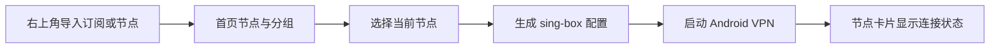
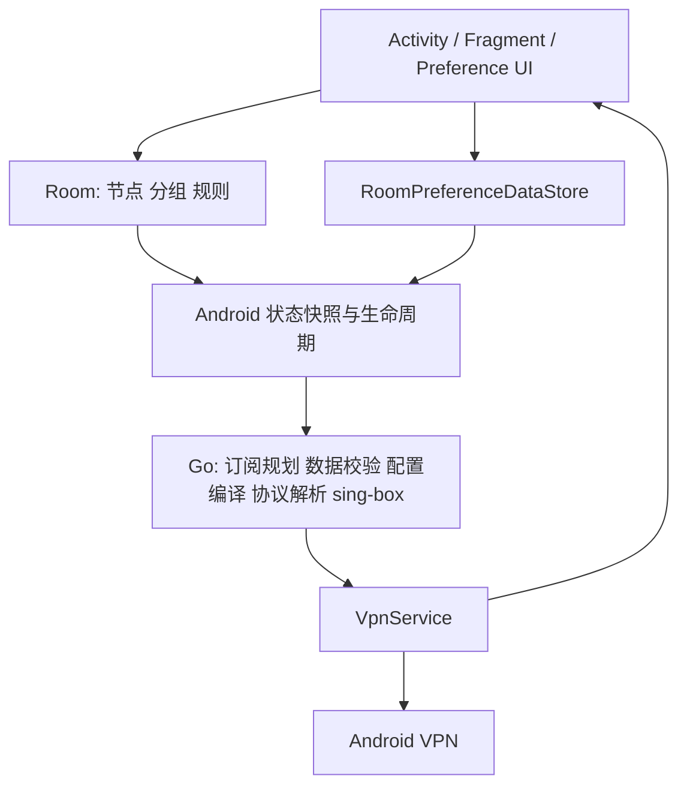

# NekoPilot 功能与界面结构

## 产品主路径

NekoPilot 的首要任务是：导入订阅或节点，选择节点，一键连接，并直接看到执行结果。

## 信息架构

底部只保留三个一级入口，首页合并分组、节点和连接，不设置左上角抽屉或“更多”页面。

| 一级入口 | 用户目标 | 主要能力 |
| --- | --- | --- |
| 首页 | 导入、选择并连接节点 | 订阅分组、二维码、剪贴板、订阅链接、节点测速、连接状态 |
| 规则 | 控制流量去向 | 中国域名/IP 直连规则更新、自定义规则、分应用代理 |
| 设置 | 调整必要行为 | 自动选择节点、TUN 实现、后台运行保护、节点 IP、局域网共享、关于 |

## 功能模块

### 节点与订阅

- 支持 SOCKS、HTTP、Shadowsocks、VMess、VLESS、Trojan、Trojan-Go、Mieru、Naive、
  Hysteria、TUIC、ShadowTLS、AnyTLS、SSH、WireGuard、自定义配置和链式代理。
- 只保留二维码、剪贴板、订阅链接和受支持深链导入；不提供文件导入或手动创建入口。
- 节点默认按延迟排序。节点联网测速同时检查实际 HTTPS 可用性，并可选测量下载速度。
- 默认由用户选择节点；开启“自动选择节点”后，后台按实际 URL 延迟选择最快可用节点，
  且仅在 TCP、UDP 和 QUIC 连接都空闲时切换。

### 连接与服务

- 只提供 Android VPN/TUN 运行方式，不提供独立的代理模式入口。
- 首页使用一个圆形按钮表达连接、连接中、已连接、停止中和未连接状态。
- 所选节点卡片展示连接中、连接成功、测速中或连接失败原因。
- 通知和快捷设置磁贴与实际所选节点及 VPN 状态保持同步。

### 路由与 DNS

- 中国域名和中国 IP 直连规则默认启用；卡片可从 GitHub 主源更新，失败时切换备用源，
  下载内容经过 SHA-256 和 sing-box 数据校验后才替换本地资产。
- DNS 路由、FakeDNS、流量探测、局域网绕过和 IPv6 策略由应用采用固定安全默认值，
  不向普通用户暴露重复开关。
- 分应用代理只采用包名白名单：开启后仅所选应用进入 VPN。首次进入执行一次推荐选择，
  后续保留用户选择；共享 UID 应用作为一个网络权限组处理。

## 代码与运行关系

Kotlin 负责 Android 生命周期、Room、权限和界面；Go 负责确定性的纯数据决策、
协议解析、配置编译、规则资产校验和 sing-box 运行。两者之间使用受测试的稳定数据边界。

## 视觉系统

- 主色使用深海军蓝，青色用于可交互强调；成功、进行中、失败分别使用统一状态色。
- 背景为浅蓝灰、卡片为白色、边框细且低阴影，主要卡片圆角为 18–20dp。
- 未连接按钮使用弱化颜色；连接中和停止中显示进度环；已连接使用明确成功色。
- 所有可进入下一级页面的设置行统一显示右侧箭头，开关项只显示开关。
- 深色外观跟随 Android 系统，不提供独立主题或夜间模式入口。
